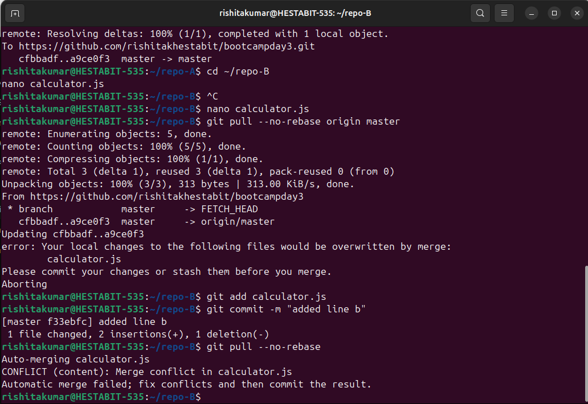
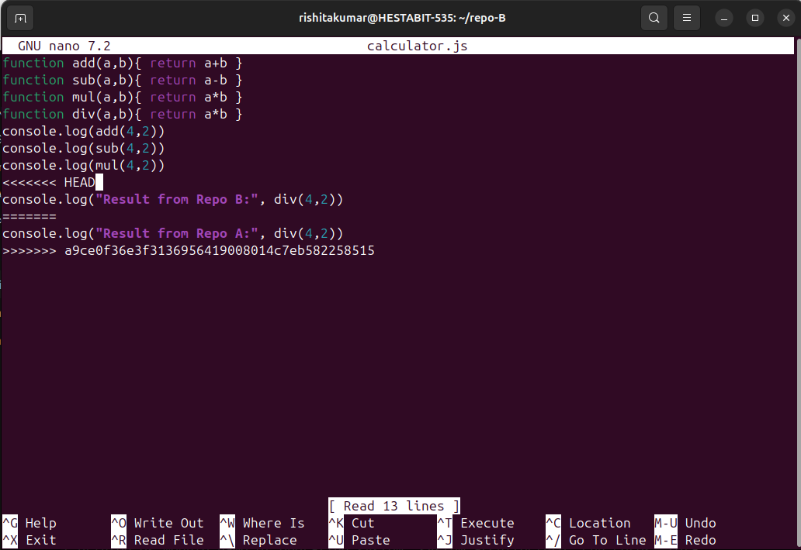
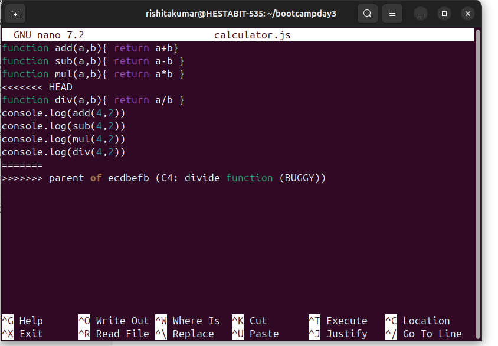
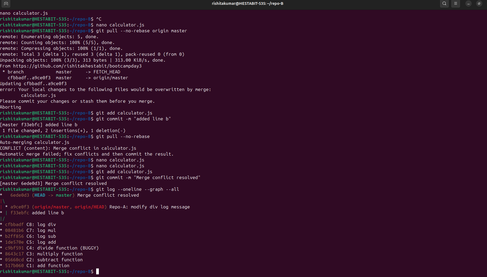

# Git Merge Conflict & Two-Clone Workflow – Postmortem

## Objective

The objective of this task was to simulate a real-world Git collaboration scenario. I intentionally worked with two separate clones of the same repository to reproduce how merge conflicts happen in team environments and how they are resolved correctly.  

Through this exercise, I aimed to demonstrate the following:

- Working with two clones of the same Git repository  
- Editing the same line in the same file from different clones  
- Triggering a merge conflict  
- Resolving the conflict while keeping both changes  
- Verifying that the commit history clearly shows branches and a merge commit

---

## Pushing the Base Repository to GitHub

I began by moving into my main working repository and checking its status:

```bash
cd ~/bootcampday3
git status

At this stage:

    The branch was already up to date with origin/master

    There were some untracked files such as:

        bisect-session.txt

        screenshots/

I then pushed the repository to GitHub to ensure it was available as a remote source for cloning:

git push origin master

This confirmed that the bootcampday3 repository was successfully published on GitHub and ready to be cloned.
Creating Two Independent Clones (Repo-A and Repo-B)

To simulate two developers working independently, I created two clones of the same GitHub repository:

cd ~
git clone https://github.com/rishitakhestabit/bootcampday3.git repo-A
git clone https://github.com/rishitakhestabit/bootcampday3.git repo-B

At this point:

    repo-A represents Developer A

    repo-B represents Developer B

Both clones started from the exact same commit history.
Making a Change in Repo-A

I navigated into repo-A and edited the calculator.js file:

cd ~/repo-A
nano calculator.js

Here, I modified the log related to the div function.
This is important because the same line would later be edited differently in Repo-B.

After making the change, I committed and pushed it to GitHub:

git add calculator.js
git commit -m "Repo-A: modify div log message"
git push origin master

At this point, GitHub had a new commit from Repo-A.
Making a Conflicting Change in Repo-B

Next, I switched to repo-B and edited the same file and the same logical line:

cd ~/repo-B
nano calculator.js

Before pulling the latest changes from GitHub, Repo-B now had local modifications.

When I attempted to pull:

git pull --no-rebase origin master

Git correctly stopped the operation with the following error:

    Your local changes would be overwritten by merge.

This is expected behavior and indicates Git is protecting local work.
Committing Local Changes in Repo-B

To proceed safely, I committed my local changes in Repo-B:

git add calculator.js
git commit -m "added line b"

Now:

    Repo-A had one commit already pushed to GitHub

    Repo-B had its own local commit touching the same line

Pulling and Triggering the Merge Conflict

After committing locally, I pulled again:

git pull --no-rebase

This time, Git attempted to merge the histories and produced a merge conflict:

CONFLICT (content): Merge conflict in calculator.js
Automatic merge failed

This conflict occurred because:

    Both Repo-A and Repo-B modified the same line

    Git could not automatically decide which version to keep



Resolving the Merge Conflict (Keeping Both Changes)

I opened the conflicted file to resolve it manually:

nano calculator.js

Inside the conflict markers (<<<<<<<, =======, >>>>>>>), I carefully edited the file to keep both changes, ensuring no functionality or intent was lost.

After resolving the conflict, I staged and committed the merge:

git add calculator.js
git commit -m "Merge conflict resolved"

This created a true merge commit, which is a key requirement of the assignment.


    Conflict markers before resolution:
    

    Final resolved file:
    

Verifying the Commit Graph

To confirm that the history correctly shows branching and a merge commit, I checked the commit graph:

git log --oneline --graph --all

The output showed:

*   6ede0d3 Merge conflict resolved
|\  
| * a9ce0f3 Repo-A: modify div log message
* | f33ebfc added line b
|/  
* cfbbadf previous commits...

This confirms:

    Two parallel commits (one from Repo-A and one from Repo-B)

    A merge commit that joins both branches

    A clear visual representation of branching and merging


Pushing the Merge Commit to GitHub

Finally, I pushed the resolved merge back to GitHub:

git push origin master


